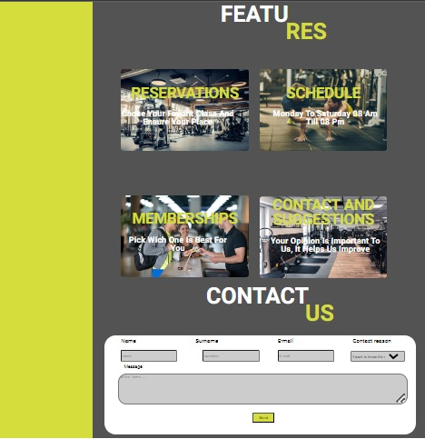

# Mega Rocket Gym

Mega Rocket Gym is an application for managing a gym. In its first version, the application presents a landing page with information about the gym, including memberships, activities, and its history. The application is currently made only with HTML and does not require installation.

# First views

# Creation process
The creation process consists of several phases, in the first week we made the design in Figma, the second week we made the structure with HTML. Then in the next stage we focus on styling this structure only in desktop.
In this fourth stage we made the responsive design, we use three different measures for mobile up to 600px, tablet from 601px to 1024px and desktop from 1025px up.

# Technologies

The technologies used so far are HTML 5 and css, and later javascript will be incorporated to give it functionality.

# How to use Mega Rocket Gym

To use the application, simply open the index.html file in any web browser. From there, you can navigate through the landing page and view the information about the gym.

# Credits

Mega Rocket Gym does not use any external code or tools.

# License

This project is under the MIT License.

# Contact
If you have any questions or comments about Mega Rocket Gym, you can contact us at rossifranco748@gmail.com