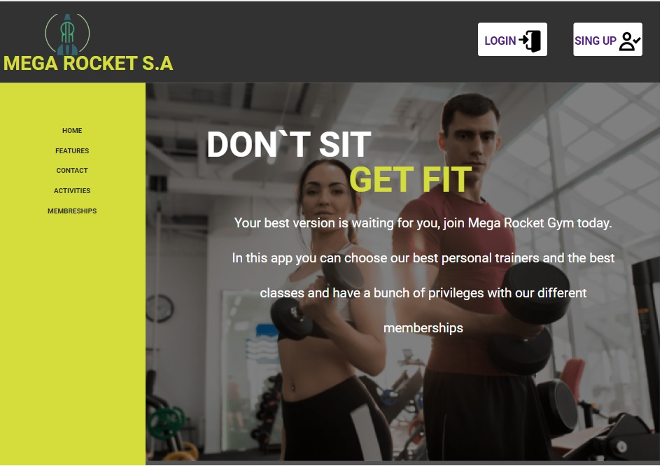

# Mega Rocket Gym

Mega Rocket Gym is an application for managing a gym. In its first version, the application presents a landing page with information about the gym, including memberships, activities, and its history. The application is currently made only with HTML and does not require installation.

## Week 04

Live site: https://franro212.github.io/BaSP-M2023/Week-04/index.html

## First views

## Creation process week by week

In the first week, we worked in groups, divided the tasks and designed the project in Figma.
In the second week, we started working individually, we started with html structuring the page with its semantic elements.
Third week we corrected the HTML errors to structure and began to style the page with CSS, this week we could not use Flexbox.
Fourth week we continue with CSS improving the styles and being able to use Flexbox, this week we focus on the different resolutions and start a mobile first focus.
In the fifth week we are working on Javascript and doing exercises touching on various topics such as variables, arrays, loops and functions.
This week the problematic is about validation with JavaScript, we did the login and sign up with all its corresponding validation.

## Week 06
https://franro212.github.io/BaSP-M2023/Week-06/index.html
## Technologies

The technologies used so far are HTML 5 and css, and later javascript will be incorporated to give it functionality.

## How to use Mega Rocket Gym

To use the application, simply open the index.html file in any web browser. From there, you can navigate through the landing page and view the information about the gym.

## Credits

Mega Rocket Gym does not use any external code or tools.

## License

This project is under the MIT License.

## Contact

If you have any questions or comments about Mega Rocket Gym, you can contact us at rossifranco748@gmail.com
